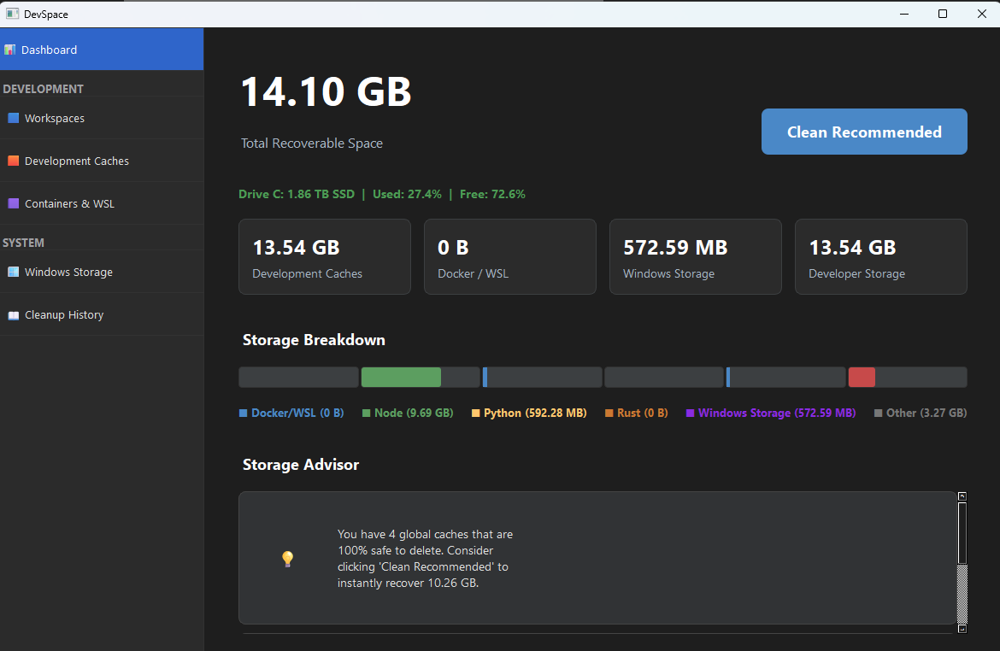
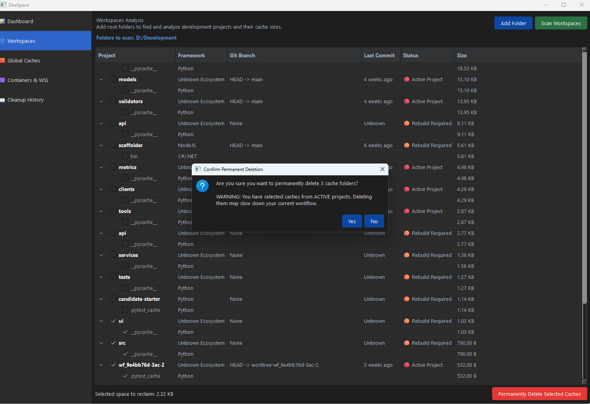
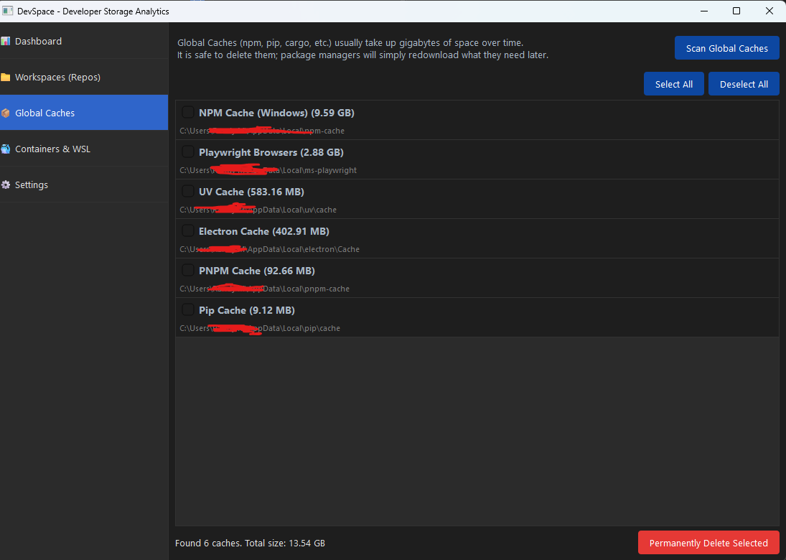
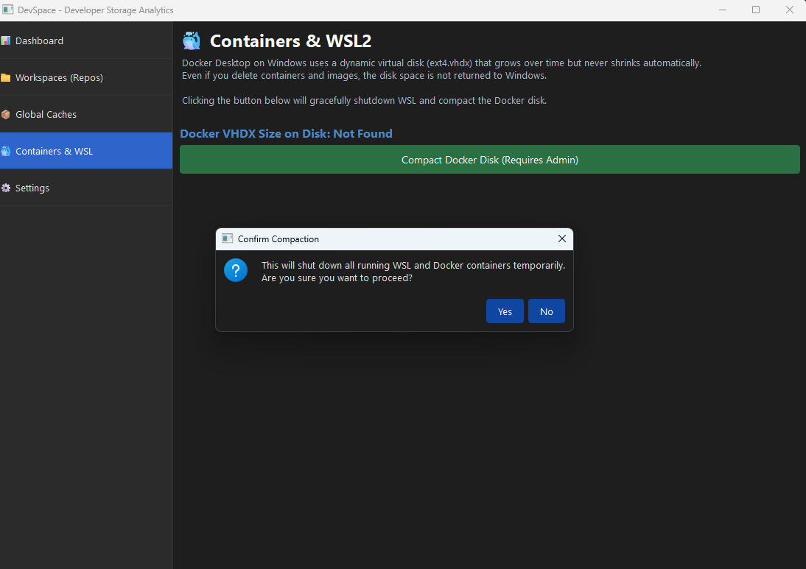
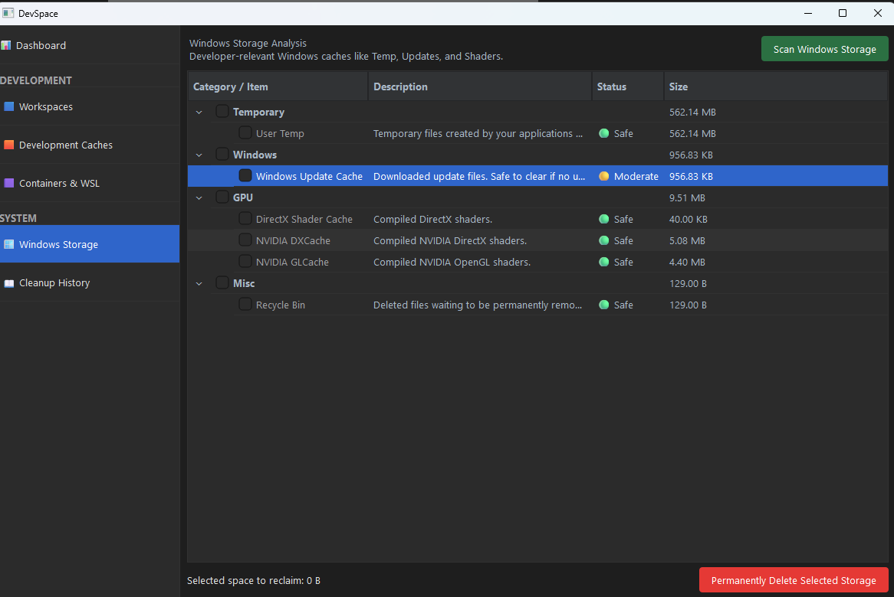
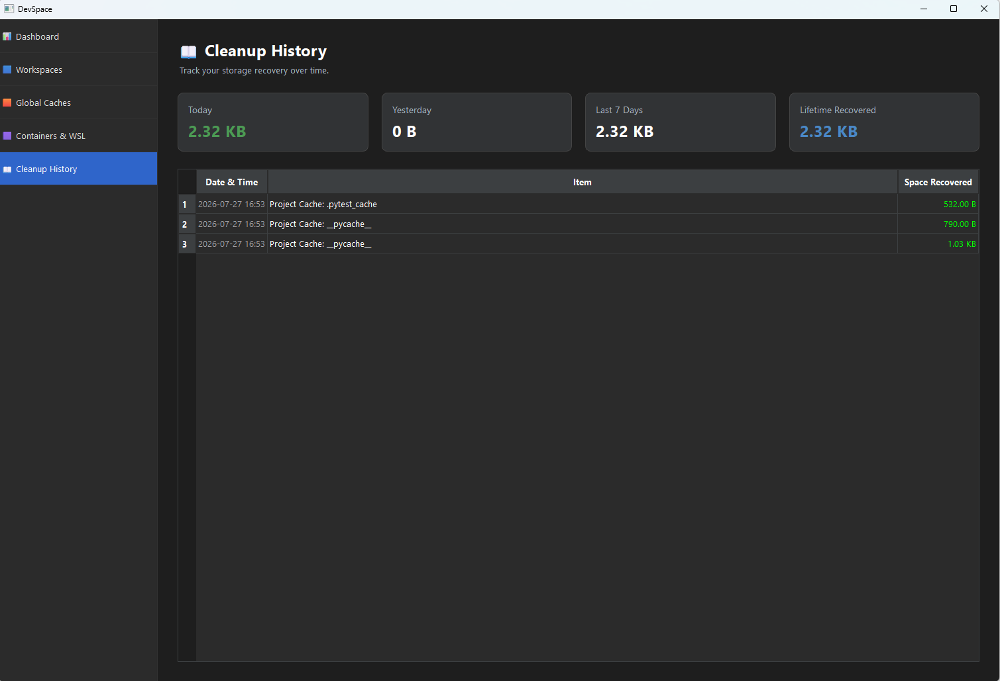

# DevSpace - Developer Storage Analyzer & Cleaner 🚀

**DevSpace Analytics is essentially CCleaner, but built exclusively for Software Developers.** 

It is a commercial-grade, standalone desktop application designed to help you understand what is consuming your disk space and safely reclaim it with deep ecosystem context. If you are struggling with low disk space on your development machine, DevSpace is the ultimate developer disk space optimizer.

## 📥 Download

- **[Download for Windows (.exe)](https://github.com/randykaskuser/devspace-storage-analyzer/releases/latest/download/DevSpace.exe)**
- **[Download for macOS (.dmg)](https://github.com/randykaskuser/devspace-storage-analyzer/releases/latest/download/DevSpace.dmg)** *(Note: macOS support is newly added and currently untested).*

Gone are the days of generic Windows cache cleaners or PC optimizers. DevSpace focuses entirely on the real developer pain points: `node_modules`, bloated global caches (`.npm`, `pip`, `cargo`), and unshrinkable WSL2/Docker virtual disks.

## 🌟 Features & Modules

The application features a sleek JetBrains-inspired sidebar navigation divided into two primary categories: **Development** and **System**.

### 1. Dashboard


The control center of DevSpace. It provides a quick overview of your development environment, displaying insights and total reclaimed space.
- **Clean Recommended**: A massive, one-click CTA (Call to Action) that intelligently and safely wipes out only `🟢 Safe` global caches without touching active workspaces.
- **Storage Breakdown**: A vibrant, horizontal stacked bar chart visualizing your Docker, Node, Python, Rust, and Windows caches proportionately.
- **Storage Advisor**: A narrative AI-style advisor that provides conversational recommendations (e.g., reminding you to clear old Playwright browser caches).
- **SSD Health Overview**: Real-time monitoring of your Drive C: capacity, including smart warnings if free space drops below 15% (which could degrade build performance).

### 2. Workspaces (Repo Analytics)


A deep storage analyzer that doesn't just show folder sizes, but provides intelligent context about your Git repositories.
- **How to use**: Click **Add Workspace Directory** to add your parent folders (e.g., `D:\Development`). Click **Scan Workspaces**. The app uses a Tree Data Grid to display your projects, their specific bloated caches (`node_modules`, `target`, `build`, `.venv`), and actionable Git context.
- **How it works**: 
  - **Ecosystem Detection**: Identifies whether a project is Node, Python, Rust, or C# based on the artifacts found.
  - **Activity Score Intelligence**: Instead of relying on unreliable Windows OS `Last Access Time`, DevSpace calculates an Activity Score (0-100) using a combination of the `Last Git Commit` age and `Last Source File Modification` timestamp.
  - **Status Badges**: Safely evaluates if a cache should be deleted with smart visual badges (`🔴 Active Project`, `🟠 Rebuild Required`, `🟡 Review`, and `🟢 Safe`).

### 3. Development Caches


Package managers often leave gigabytes of hidden "garbage" across your system profile. DevSpace automatically locates these hard-to-find Windows-specific caches.
- **How to use**: Simply open the tab and click **Scan Global Caches**. It will instantly find caches like NPM (`AppData\Local\npm-cache`), Pip/uv (`AppData\Local\uv\cache`), Rust Cargo, Maven, Gradle, Playwright Browsers, and Electron caches.
- **How it works**: Uses a predefined dictionary of known package manager paths mapped to your `USERPROFILE` and `LOCALAPPDATA`. It rapidly calculates sizes and safely purges them.

### 4. Containers & WSL2


Docker Desktop on Windows uses a dynamic virtual disk (`ext4.vhdx`) that grows over time but never shrinks automatically, even after images are pruned.
- **How to use**: Click **Compact Docker Disk**. (Requires running DevSpace as Administrator).
- **How it works**: Gracefully shuts down the WSL engine (`wsl --shutdown`) and executes a low-level Windows `diskpart` script to mount, compact, and detach the `ext4.vhdx`, immediately returning gigabytes of space back to the host OS.

### 5. Windows Storage


*A dedicated scanner for developer-adjacent Windows OS caches that frequently bloat your system.*
- **How to use**: Navigate to the tab to analyze your OS-level caches.
- **How it works**: Intelligently identifies and cleans caches that developers often generate heavily: Windows Update Cache, Delivery Optimization, `User Temp`, `Windows Temp`, DirectX/NVIDIA/AMD Shader Caches, and the Recycle Bin. It strictly avoids generic "PC Optimizer" territory (no registry cleaners).

### 6. Cleanup History


A persistent log tracking your storage recovery journey over time.
- **How to use**: Simply navigate to the tab to see a breakdown of your reclaimed space.
- **How it works**: Records each cleanup action into a local SQLite-style database in your `%USERPROFILE%\.devspace\` directory. It tracks how much storage you've recovered Today, Yesterday, and in the Last 7 Days, alongside a global **Lifetime Recovered Space** metric.

## 🛠️ Tech Stack & Architecture
- **Language**: Python 3.12
- **GUI Framework**: PySide6 (Qt for Python)
- **Packaging**: PyInstaller (Standalone `.exe`)
- **Key Integration**: Git subprocesses, DiskPart scripts, Windows UI scaling.

### Architecture
The app follows a strict MVC-like architecture separating the core logic from the UI thread to prevent blocking the UI during heavy filesystem operations:
- `core/`: Contains the pure backend logic (`repo_cleaner.py`, `global_cache_cleaner.py`, `trash.py`, `system_info.py`).
- `ui/`: Contains the PySide6 views and threading components (`main_window.py`, `repo_tab.py`, `global_caches_tab.py`, `containers_tab.py`).
- `main.py`: The entry point that initializes the `QApplication` and applies the custom Darcula-style Dark Theme (`ui/theme.py`).

## 🚀 Building the App

To compile the app into a standalone Windows executable (`.exe`), you must use the included build script from within the virtual environment:

```powershell
# 1. Activate the virtual environment
.\.venv\Scripts\activate

# 2. Run the build script
python build.py
```

The resulting executable will be generated at `dist/SpaceUp.exe`.
